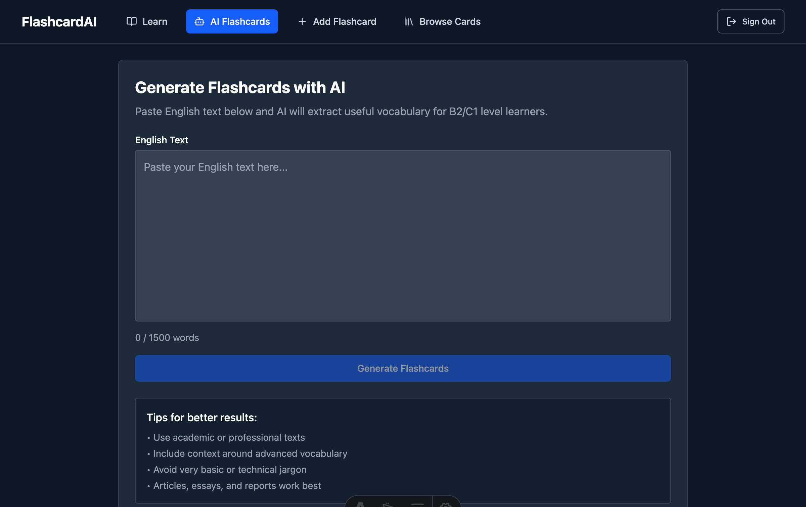

# FlashcardAI

An AI-powered flashcard application for English B2/C1 level learners. Generate flashcards from text using AI, create them manually, and test your knowledge with interactive quizzes.

## Features

- 🤖 **AI Flashcard Generation** - Extract vocabulary from text using OpenAI GPT-4o
- ✏️ **Manual Creation** - Create custom flashcards with English-Polish translations
- 🧠 **Interactive Quiz** - Test knowledge with 4-option multiple choice questions
- 📚 **Flashcard Management** - Browse, edit, and delete your flashcard collection
- 🔐 **User Authentication** - Secure login with demo account available
- 🌙 **Dark Theme** - Modern, responsive design optimized for learning
- 🎯 **B2/C1 Focus** - Specifically designed for advanced English learners

## Screenshots

### Login Interface


_Clean authentication interface with demo account option_

### Interactive Quiz


_Test your vocabulary knowledge with multiple-choice questions and real-time scoring_

### AI Flashcard Generation


_Paste English text and let AI extract B2/C1 vocabulary automatically_

### Manual Flashcard Creation


_Create custom flashcards with English-Polish translations_

### Flashcard Management


_Browse and manage your collection of 25+ vocabulary cards with edit/delete options_

## Tech Stack

- [Astro](https://astro.build/) v5.5.5 - Modern web framework
- [React](https://react.dev/) v19.0.0 - UI components
- [TypeScript](https://www.typescriptlang.org/) v5 - Type safety
- [Tailwind CSS](https://tailwindcss.com/) v4.0.17 - Styling
- [Supabase](https://supabase.com/) - Database and authentication
- [OpenRouter.ai](https://openrouter.ai/) - AI API access

## Prerequisites

- Node.js v22.14.0 or later
- npm (comes with Node.js)
- [Supabase CLI](https://supabase.com/docs/guides/cli/getting-started) v1.0.0 or later
- [Docker](https://docker.com/) (for Supabase local development)

## Quick Start

### Option 1: Automated Setup (Recommended)

```bash
git clone <repository-url>
cd 10xCards
npm install

# Run automated setup script
# Linux/macOS:
./scripts/setup.sh

# Windows PowerShell:
.\scripts\setup.ps1

# Or using npm:
npm run setup
```

The setup script will:

- Install Supabase CLI (if needed)
- Start Supabase local instance
- Configure environment variables automatically
- Set up database with demo data
- Provide next steps

### Option 2: Manual Setup

#### 1. Clone and Install

```bash
git clone <repository-url>
cd 10xCards
npm install
```

#### 2. Install Supabase CLI

```bash
# macOS
brew install supabase/tap/supabase

# Windows (PowerShell)
Invoke-WebRequest -Uri https://github.com/supabase/cli/releases/latest/download/supabase_windows_amd64.tar.gz -OutFile supabase.tar.gz

# Linux
curl -fsSL https://github.com/supabase/cli/releases/latest/download/supabase_linux_amd64.tar.gz | tar -xz
```

#### 3. Set Up Environment

Copy the example environment file:

```bash
cp .env.example .env
```

#### 4. Start Supabase

```bash
# Start Supabase local development
supabase start

# This will output your local credentials - copy the anon key
```

#### 5. Configure Environment Variables

Update `.env` with your Supabase credentials:

```env
# Supabase Configuration (from supabase start output)
PUBLIC_SUPABASE_URL=http://127.0.0.1:54321
PUBLIC_SUPABASE_ANON_KEY=your_actual_anon_key_here

# OpenRouter.ai Configuration (optional - for AI features)
OPENROUTER_API_KEY=your_openrouter_api_key_here
```

#### 6. Set Up Database

```bash
# Reset database and run migrations
supabase db reset

# Seed with demo data
supabase db seed
```

#### 7. Start Development Server

```bash
npm run dev
```

Visit `http://localhost:3000` and sign in with:

- **Email**: `demo@example.com`
- **Password**: `demopass`

## Getting OpenRouter API Key (Optional)

AI flashcard generation requires an OpenRouter API key:

1. Visit [OpenRouter.ai](https://openrouter.ai/)
2. Sign up for an account
3. Generate an API key
4. Add it to your `.env` file as `OPENROUTER_API_KEY`

**Note**: The app works without an API key, but AI generation will be disabled.

## Available Scripts

### Development

- `npm run dev` - Start development server
- `npm run build` - Build for production
- `npm run preview` - Preview production build
- `npm run setup` - Run automated setup script

### Code Quality

- `npm run lint` - Run ESLint
- `npm run lint:fix` - Fix ESLint issues
- `npm run format` - Format code with Prettier
- `npm run format:check` - Check code formatting

### Testing

- `npm test` - Run tests in watch mode
- `npm run test:unit` - Run unit tests with coverage
- `npm run test:integration` - Run integration tests
- `npm run test:watch` - Run tests in watch mode
- `npm run test:ui` - Open Vitest UI
- `npm run test:coverage` - Generate coverage report

### Database

- `npm run db:reset` - Reset database with fresh migrations
- `npm run db:seed` - Seed database with demo data
- `supabase start` - Start local Supabase
- `supabase stop` - Stop local Supabase
- `supabase status` - Check Supabase status

## Project Structure

```
├── src/
│   ├── components/          # React components
│   │   ├── ui/             # Reusable UI components
│   │   ├── AuthForm.tsx    # Authentication
│   │   ├── Quiz.tsx        # Quiz interface
│   │   ├── FlashcardApp.tsx # Main app
│   │   └── ...
│   ├── lib/                # Utilities and API clients
│   │   ├── auth.ts         # Authentication logic
│   │   ├── supabase.ts     # Database client
│   │   └── openrouter.ts   # AI API client
│   ├── pages/              # Astro pages
│   │   ├── api/            # API endpoints
│   │   └── index.astro     # Main page
│   └── layouts/            # Page layouts
├── supabase/               # Database configuration
│   ├── config.toml         # Supabase config
│   ├── migrations/         # Database migrations
│   └── seed.sql           # Demo data
└── public/                 # Static assets
```

## Features Overview

### Authentication

- Email/password registration and login
- Password reset functionality
- Demo account for testing
- Secure session management

### AI Flashcard Generation

- Paste English text (up to 1500 words)
- AI extracts B2/C1 level vocabulary
- Review and edit suggestions before saving
- Powered by OpenAI GPT-4o via OpenRouter

### Manual Flashcard Creation

- Create custom English-Polish flashcard pairs
- Simple form interface
- Instant save to your collection

### Interactive Quiz

- Random flashcard selection
- 4-option multiple choice format
- Instant feedback with color coding
- Score tracking and statistics
- Unlimited questions

### Flashcard Management

- Browse your complete collection
- Edit existing flashcards
- Delete unwanted cards
- Filter by source (AI, manual, default)

## Database Schema

The app uses a simple PostgreSQL schema with Supabase:

```sql
-- Flashcards table
CREATE TABLE flashcards (
    id UUID PRIMARY KEY DEFAULT uuid_generate_v4(),
    user_id UUID REFERENCES auth.users(id) ON DELETE CASCADE,
    front TEXT NOT NULL,  -- English word/phrase
    back TEXT NOT NULL,   -- Polish translation
    source VARCHAR(10) DEFAULT 'manual' CHECK (source IN ('ai', 'manual', 'default')),
    created_at TIMESTAMP WITH TIME ZONE DEFAULT NOW(),
    updated_at TIMESTAMP WITH TIME ZONE DEFAULT NOW()
);
```

Row Level Security (RLS) ensures users can only access their own flashcards.

## Testing

The project includes comprehensive testing setup with:

### Test Framework

- **Vitest** - Fast, Vite-native test runner
- **Testing Library** - React component testing
- **jsdom** - Browser environment simulation
- **Coverage with v8** - Built-in code coverage

### Test Types

#### Unit Tests

```bash
npm run test:unit
```

Tests core functions and components:

- `src/lib/*.test.ts` - Library function tests
- `src/components/**/*.test.tsx` - Component tests
- Mocks external dependencies (Supabase, fetch)

#### Integration Tests

```bash
npm run test:integration
```

Tests API endpoints and database interactions:

- `src/**/*.integration.test.ts` - Integration tests
- Requires running Supabase locally
- Tests real API calls and database operations

#### Coverage Reports

```bash
npm run test:coverage
```

Generates detailed coverage reports in `coverage/` directory.

**Note**: The `coverage/` directory is automatically generated and should not be committed to the repository (it's included in `.gitignore`).

### Running Tests

```bash
# Run all tests
npm test

# Run tests with UI
npm run test:ui

# Run tests in watch mode during development
npm run test:watch

# Run only unit tests
npm run test:unit

# Run only integration tests (requires Supabase)
npm run test:integration
```

### CI/CD Pipeline

GitHub Actions automatically:

- Runs linting and formatting checks
- Executes unit tests on Node.js 20.x and 22.x
- Runs integration tests with Supabase
- Generates coverage reports
- Performs security audits
- Builds the application

Tests run on every push and pull request to main branches.

## Deployment

### Docker (Recommended)

```bash
# Build and run with Docker
docker-compose up -d
```

### Manual Deployment

1. Build the application:

```bash
npm run build
```

2. Set up Supabase project:

- Create a new project at [supabase.com](https://supabase.com)
- Run migrations: `supabase db push`
- Update environment variables with production URLs

3. Deploy to your preferred platform (Vercel, Netlify, etc.)

### CI/CD Deployment

The project includes automated deployment workflows:

- **Vercel** - Automatic deployment on push to main
- **Docker Hub** - Docker image building on releases
- **Environment secrets** - Secure handling of API keys

## Troubleshooting

### Supabase Issues

- **Port conflicts**: Stop other services on ports 54321-54324
- **Docker issues**: Ensure Docker is running
- **Migration errors**: Try `supabase db reset`

### Environment Issues

- **Missing API key**: AI features will be disabled but app still works
- **Wrong URLs**: Ensure LOCAL URLs for development, PRODUCTION URLs for deployment

### Common Problems

- **Login fails**: Check if demo user exists in database
- **No flashcards**: Ensure seed data was loaded
- **AI not working**: Verify OpenRouter API key is valid

## Contributing

1. Fork the repository
2. Create a feature branch
3. Make your changes
4. Run the test suite:
   ```bash
   npm run lint
   npm run test:unit
   npm run build
   ```
5. Submit a pull request

### Development Workflow

1. **Setup**: Run `npm run setup` for automated environment setup
2. **Development**: Use `npm run dev` with `npm run test:watch`
3. **Testing**: Write tests for new features and bug fixes
4. **Quality**: Ensure all tests pass and code is properly formatted
5. **CI**: GitHub Actions will verify your changes automatically

## License

MIT

---

**Demo Account**: `demo@example.com` / `demopass` (25 pre-loaded B2/C1 flashcards)
